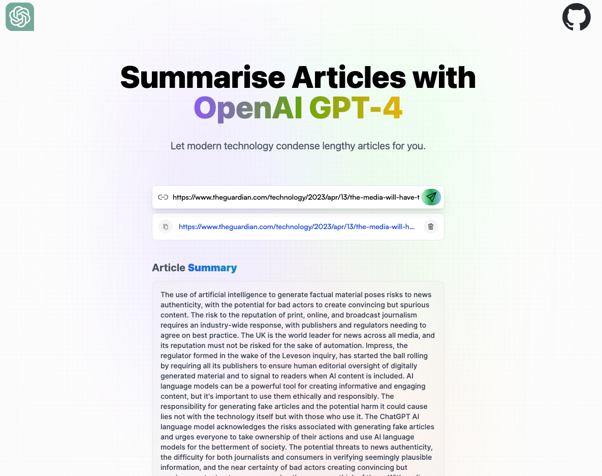

# AI Article Summariser Application

This app allows the end user to condense webpages and articles into smaller bodies of text using the Article Extractor and Summarizer API available at https://rapidapi.com/restyler/api/article-extractor-and-summarizer

## How Do I Use This App?

This app is available online at https://ai-summariser.netlify.app/

## How Do I Build On This App?

This app uses React and TailwindCSS and is bundled using Vite.
It also uses the Rapid API available at the link above.

- Clone the repo or download the zip
- Run npm i to install dependencies

- Get a RapidAPI key from the Article Extractor and Summarizer page
- Create a .env file with VITE_RAPID_API_ARTICLE_KEY=xxxxxxxxxxxxxxxxxxxxxxxx (This should be your key)

### Local run

- npm run dev

### Build

- npm run build

## Are contributions welcome?

Yes! This is an open source project and new features are welcome to be added. I've recently added the ability to delete copied content from local storage and I'm looking forward to adding more features.
